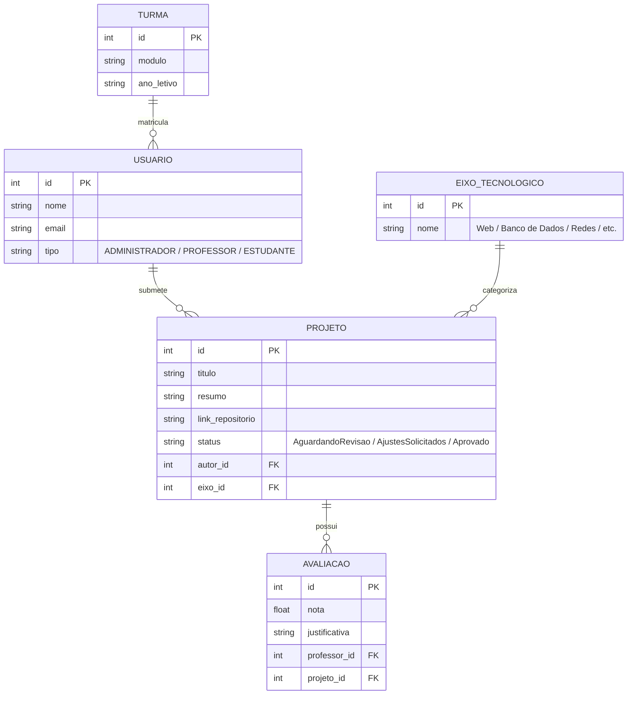
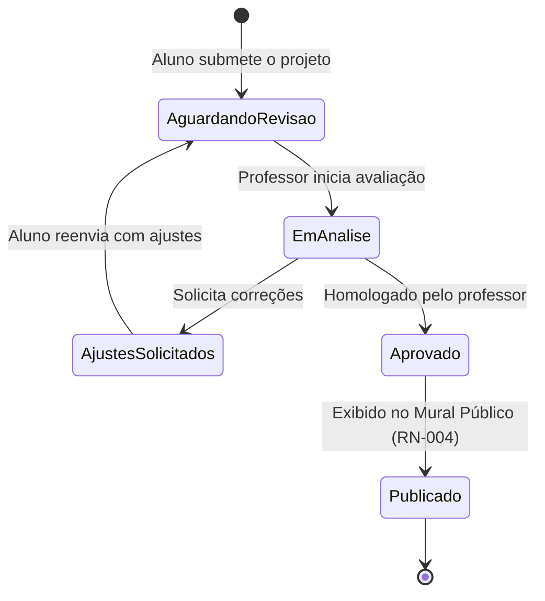

# Relatório de Arquitetura e Modelagem do Sistema

**Projeto:** Mural Virtual de Projetos de Informática CTBJ / UFPI

**Desenvolvedor:** Álvaro Marques Araújo 

**Etapa:** 2 - Planejamento Operacional e Gestão Ágil

---

## 1. Visão Geral da Solução

O Mural Virtual do CTBJ é uma aplicação web dividida em 3 camadas:

* **Frontend:** Interface web em Next.js (React) adaptada para telas de desktop e dispositivos móveis (RNF-002).
* **Backend:** API Node.js para sanitização de dados (RN-005) e validação de URLs do GitHub (RN-001).
* **Banco de Dados:** Base de dados relacional para persistência de alunos, turmas, projetos e notas.

---

## 2. Diagrama Entidade-Relacionamento (Modelo de Dados)

---

## 3. Diagrama de Transição de Estados (Workflow de Homologação)

---

## 4. Matriz de Rastreabilidade (Trello ↔ GitHub)

| Cartão no Trello | Requisitos Relacionados | Objetivo na Aplicação |
| --- | --- | --- |
| `[RF-001/002]` | RF-001, RF-002, RN-001, RN-002, RN-003 | Form de Submissão e validações de mídia/URL |
| `[RF-004/005/006]` | RF-004, RF-005, RF-006, RN-004 | Painel do Professor Orientador e Homologação |
| `[RF-007/008]` | RF-007, RF-008, RNF-001 | Busca Full-Text e Filtros por Eixo Tecnológico |
| `[RNF-002/RN-005]` | RNF-002, RN-005 | Responsividade da UI e Segurança contra scripts |
| `[DOC-02]` | Documentação da Etapa 2 | Criação deste relatório de arquitetura |

---
