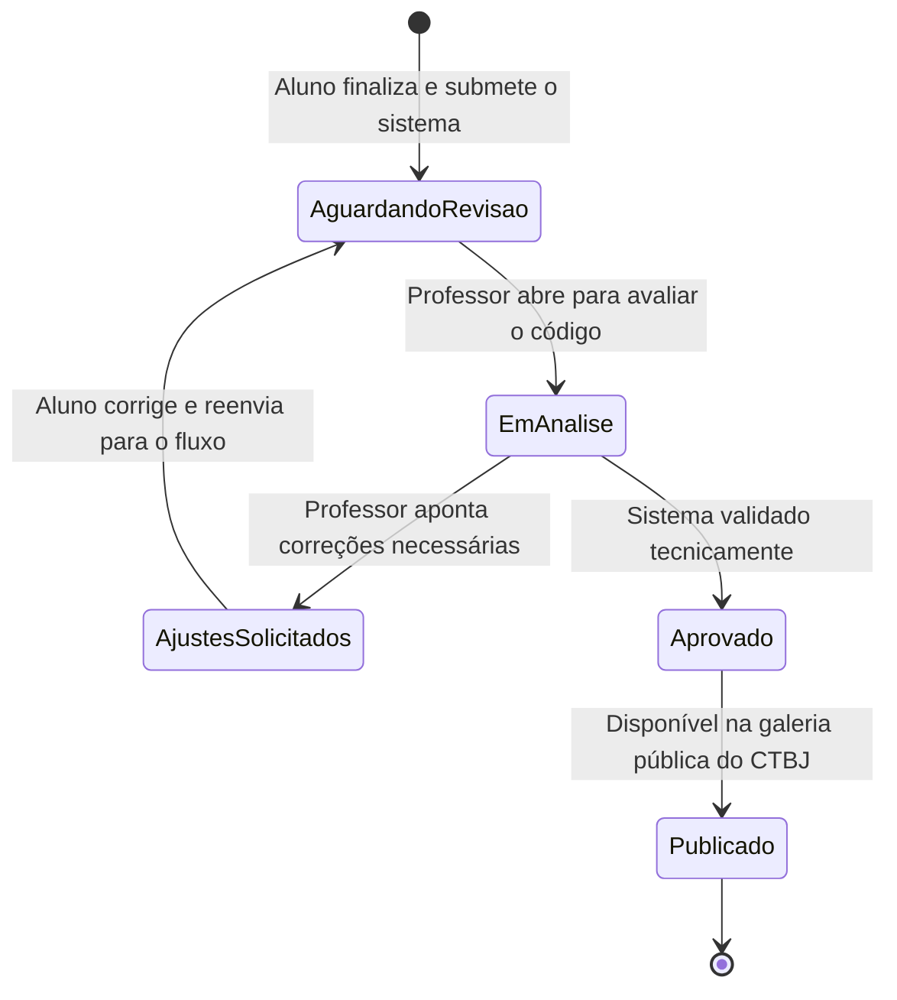

#  Mural Virtual de Projetos de Informática CTBJ

Este documento detalha os requisitos de engenharia, restrições arquiteturais e regras de negócio que governam o ecossistema do Mural Virtual, homologado exclusivamente para o **Curso Técnico em Informática do Colégio Técnico de Bom Jesus (CTBJ/UFPI)**.

---

##  1. Atores e Usuários do Sistema

*   **Administrador do Curso (Coordenador de TI):** Usuário com privilégios totais sobre o sistema. Gerencia os parâmetros, as turmas ativas do técnico em informática, remove conteúdos inadequados e extrai relatórios de submissões.
*   **Professor / Orientador:** Membro do corpo docente técnico do CTBJ. Possui permissão para avaliar o código-fonte enviado pelos alunos, homologar projetos em sua área de atuação e emitir pareceres de revisão.
*   **Estudante de Informática (Autor):** Aluno regularmente matriculado no curso técnico. Possui permissão para submeter os artefatos de seus softwares (códigos, documentações e capturas de tela) vinculados às disciplinas do curso.
*   **Avaliador Externo / Comunidade:** Demais alunos,visitantes e empresas de tecnologia da região de Bom Jesus. Possuem acesso anônimo e restrito apenas à leitura, busca e interações sociais básicas no mural público.

---

##  2. Requisitos Funcionais (RF)

### 2.1. Módulo de Gestão de Artefatos de Software
*   **RF-001:** O sistema deve permitir ao estudante cadastrar projetos preenchendo: Título da Aplicação, Resumo Técnico, Link público do Repositório (GitHub/GitLab), Capturas de Tela do Sistema (Mídias) e a Listagem das Tecnologias Utilizadas (Tags de Stack).
*   **RF-002:** O sistema deve obrigar a vinculação do projeto a um dos eixos temáticos do curso: *Desenvolvimento Web*, *Programação*, *Sistemas Operacionais*, *Banco de Dados* ou *Redes de Computadores*.
*   **RF-003:** O sistema deve permitir que o autor adicione múltiplos coautores ao projeto, desde que estejam cadastrados na mesma turma técnica do CTBJ.

### 2.2. Módulo de Workflow de Homologação (Banca e Orientação)
*   **RF-004:** O sistema deve colocar todo projeto recém-submetido no estado de `Aguardando Revisão`, tornando-o invisível no feed público.
*   **RF-005:** O sistema deve listar no painel do professor orientador os projetos pendentes que foram direcionados ao seu nome.
*   **RF-006:** O sistema deve permitir ao professor alterar o estado do projeto para `Aprovado` (publicando-o automaticamente) ou `Ajustes Solicitados` (retornando o projeto para edição do aluno com uma justificativa em texto).

### 2.3. Módulo de Motor de Busca e Filtros
*   **RF-007:** O sistema deve fornecer uma barra de pesquisa com busca por texto completo (*Full-Text Search*) operando sobre os títulos e resumos das aplicações.
*   **RF-008:** O sistema deve disponibilizar filtros rápidos por Linguagem/Framework (ex: Python, PHP,) e por Eixo Temático.

---
##  3. Requisitos Não Funcionais (RNF)

*   **RNF-001 (Desempenho de Renderização):** A listagem inicial dos cards de sistemas deve carregar em menos de 1.2 segundos utilizando estratégias de paginação ou carregamento sob demanda (*lazy loading*), considerando as conexões de rede dos laboratórios do CTBJ.
*   **RNF-002 (Portabilidade e Responsividade):** A interface do usuário deve ser 100% responsiva, adaptando-se perfeitamente aos monitores do laboratório de informática (padrão desktop 1080p) e aos dispositivos móveis dos alunos.
*   **RNF-003 (Disponibilidade e Persistência):** O sistema deve utilizar uma estratégia de backup automatizada diária para a base de dados SQL, garantindo integridade contra falhas de energia locais.

---

##  4. Regras e Condições de Negócio (RN)

*   **RN-001 (Verificação de Repositório Ativo):** Um projeto só poderá ser submetido se o link fornecido para o código-fonte for uma URL válida pertencente aos domínios do GitHub ou GitLab.
*   **RN-002 (Restrição de Arquivos de Mídia):** O sistema deve rejeitar uploads de imagens de tela do software superiores a 5MB e formatos que não sejam otimizados para web (formatos aceitos: JPEG, PNG e WebP).
*   **RN-003 (Bloqueio de Duplicidade Técnica):** O sistema não deve permitir o cadastro de dois projetos diferentes que utilizem exatamente a mesma URL de repositório do GitHub.
*   **RN-004 (Imutabilidade pós-Aprovação):** Assim que um projeto for marcado como `Aprovado` pelo professor orientador, o estudante autor perderá a permissão de edição direta sobre os dados textuais, sendo necessária a abertura de uma solicitação manual junto à coordenação técnica para qualquer alteração.
*   **RN-005 (Tratamento contra Códigos Maliciosos):** Todos os dados inseridos nos campos de texto do formulário de cadastro devem passar por um processo de sanitização obrigatório no backend para neutralizar tags HTML ou scripts injetados antes do salvamento na base de dados.

---

##  5. Diagrama de Transição de Estados do Projeto

